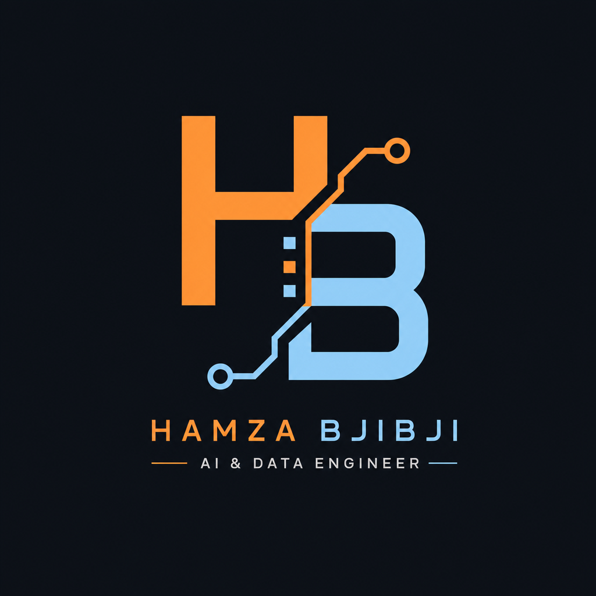



  

 
 

  
   
  

---

## Expertise

| Data Engineering | AI / Machine Learning | Full-Stack |
|:---:|:---:|:---:|
|  &nbsp;&nbsp; |   |  &nbsp; |
| Kafka · Spark · Iceberg · Airflow · Cassandra · Medallion · MinIO | TensorFlow · sklearn · Flask · MLOps · Forecasting | React · Node · Postgres · MongoDB · Azure · Docker · CI/CD |

---

## Connect

  

**Tetouan, Morocco** · Open to Internships · Freelance · Collaborations  
Seeking: **Data Engineering · MLOps · Full-Stack**

 

  

## My Contribution snake

 

pipelines over slides · last sync Jul 2026

