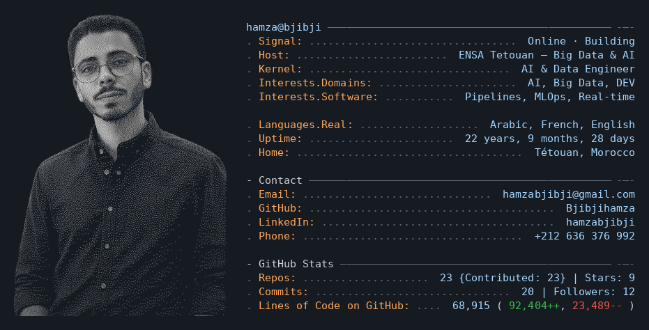

<div align="center">

```
 _                     _
| |__   __ _ _ __ ___ | | __ _
| '_ \ / _` | '_ ` _ \| |/ _` |
| |_) | (_| | | | | | | | (_| |
|_.__/ \__,_|_| |_| |_|_|\__,_|
          b j i b j i
```


<br/>

[](https://github.com/Bjibjihamza)

</div>

<br/>

<div align="center">
  
</div>

---

## `$ ls -la ~/expertise`

```text
~/expertise/
├── data-eng/     Kafka · Spark · Iceberg · Airflow · Medallion · MinIO
├── ai-ml/        TensorFlow · sklearn · MLOps · forecasting · CVSS
└── full-stack/   React · Node · Postgres · Docker · CI/CD · TypeScript
```

---

## `$ cat ~/tech-stack.json`

```json
{
  "languages": ["JavaScript", "Python", "TypeScript", "C#", "SQL"],
  "big_data": ["Kafka", "Spark", "Airflow", "Cassandra", "Iceberg", "MinIO"],
  "frontend": ["React", "Vite", "Tailwind CSS"],
  "backend": ["Node.js", "Express", "PostgreSQL", "MongoDB", "Oracle"],
  "cloud_devops": ["Azure", "Huawei Cloud", "Docker", "Nginx"],
  "ml_ai": ["TensorFlow", "scikit-learn", "Flask"]
}
```

---

## `$ git log --oneline --all` — Featured Projects

```text
EDUPATH/                      [active]   Math learning · monorepo
                             React 19 · Vite · Tailwind · Node · Postgres

Real-Time-Car-Price/          [stable]   Kafka → Spark → ML pricing
                             Kafka · Spark · Cassandra · TensorFlow · Airflow

threat-intelligence-pipeline/ [stable]   CVE warehouse · 313K+ vulns
                             Medallion · Telethon · PostgreSQL

renewstation-huawei-cloud/    [stable]   Energy forecast · R² 99.8%
                             RandomForest · Airflow MLOps · 278K points

smart-estate-recommender/     [stable]   Avito/Mubawab lakehouse
                             Kafka · Spark Streaming · Iceberg · MinIO

car-rental-bi-platform/       [active]   BI + IoT telemetry · 5 cities
                             Oracle · Medallion · GPS/fuel twin
```

[EDUPATH](https://github.com/Bjibjihamza/EDUPATH) ·
[Car Price](https://github.com/Bjibjihamza/Real-Time-Car-Price-Recommendation-and-Prediction-System-with-Kafka-and-Spark) ·
[Threat Intel](https://github.com/Bjibjihamza/threat-intelligence-pipeline) ·
[RenewStation](https://github.com/Bjibjihamza/renewstation-huawei-cloud) ·
[Smart Estate](https://github.com/Bjibjihamza/smart-estate-recommender-valuator) ·
[Car Rental BI](https://github.com/Bjibjihamza/car-rental-bi-platform)

> 12 more repos → [github.com/Bjibjihamza?tab=repositories](https://github.com/Bjibjihamza?tab=repositories)

---

## `$ tail -f ~/growth.log`

```text
# growth.log — commits that changed direction
2024-07  First commit. ABR Watches — e-commerce, vanilla JS
2025-02  NovaDrive + Code Source Scraper — tooling & frontend
2025-04  Kafka enters. Real-Time Car Price System launches
2025-06  First team project — Club-Site (3 devs)
2025-10  Threat Intel Pipeline + CarRental WPF + Car BI
2025-11  Lakehouse stack: Iceberg + MinIO + Spark Streaming
2025-12  RenewStation ships: 99.8% R² on energy prediction
2026-02  Azure MLOps pipeline for real estate analytics
2026-04  EDUPATH goes live — React 19 monorepo
```

---

## `$ ping hamza`

```text
host:     Tétouan, Morocco
email:    hamzabjibji@gmail.com
github:   github.com/Bjibjihamza
linkedin: linkedin.com/in/hamzabjibji
phone:    +212 636 376 992
open_to:  Internships · Freelance · Collaborations
seeking:  Data Engineering · MLOps · Full-Stack
```

<div align="center">

[email](mailto:hamzabjibji@gmail.com) ·
[github](https://github.com/Bjibjihamza) ·
[linkedin](https://linkedin.com/in/hamzabjibji) ·
[whatsapp](https://wa.me/212636376992)

<br/>

`$ watch contrib`


<br/>

<sub>built with too many Kafka consumers · last sync Jul 2026</sub>

</div>
